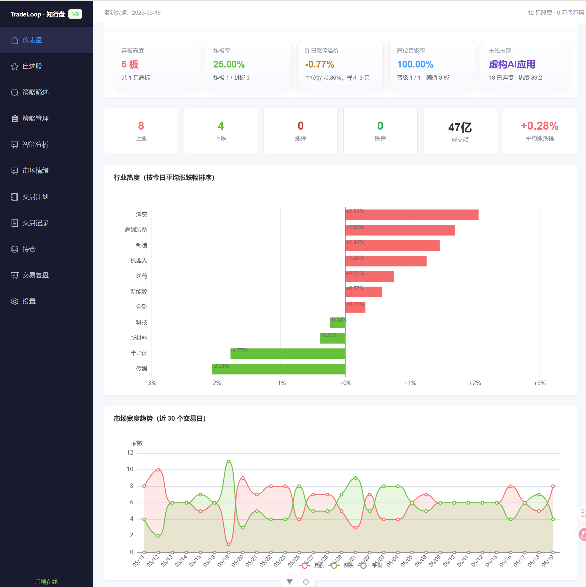
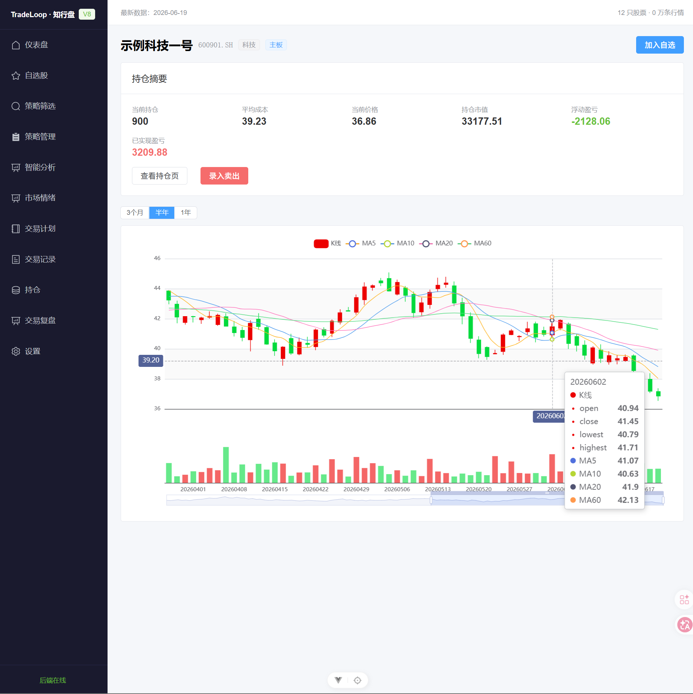
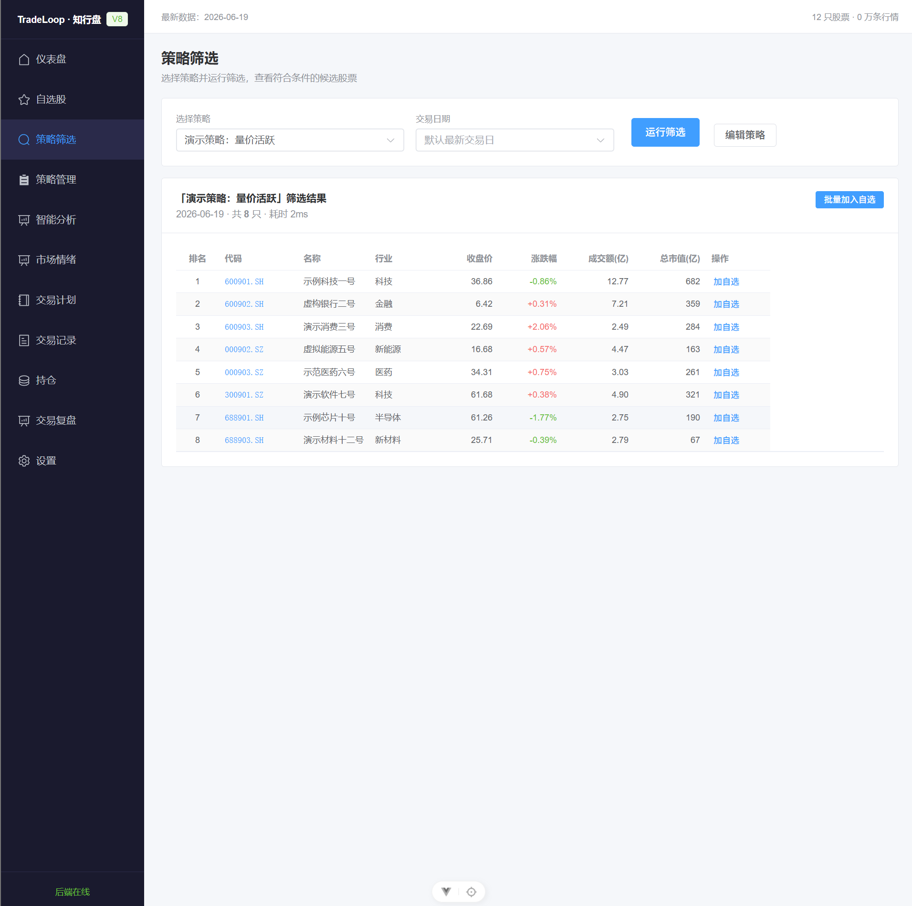
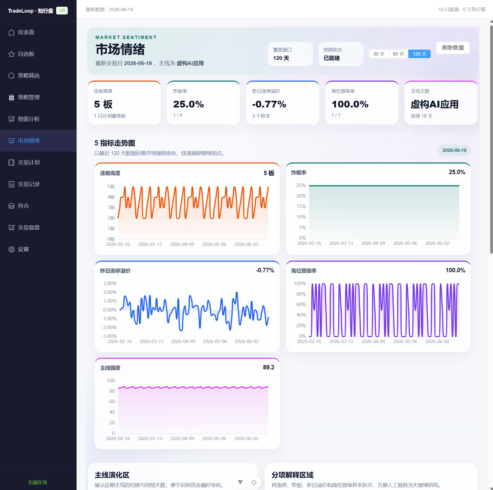
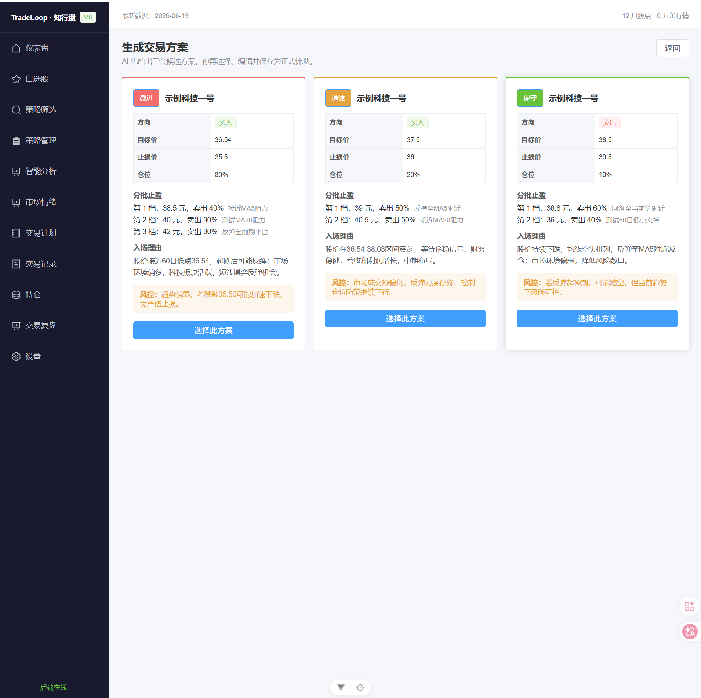
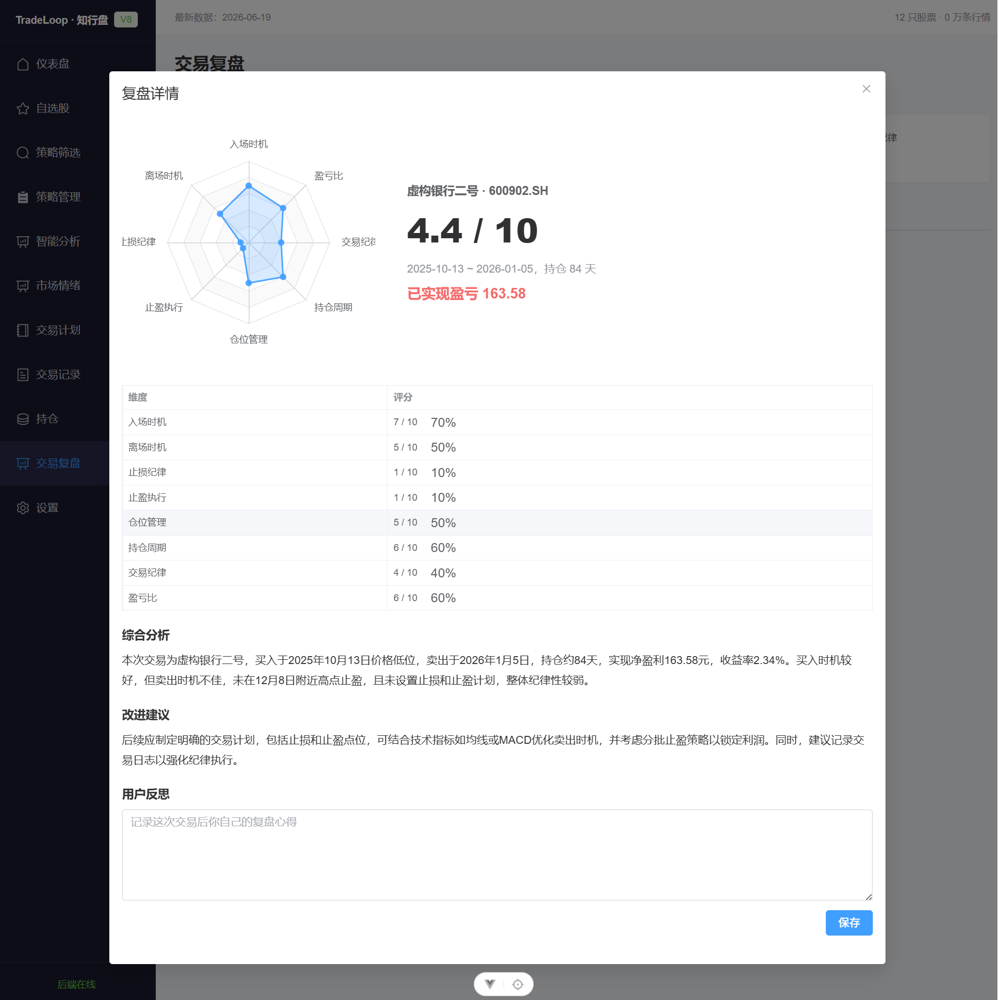

<div align="center">

# TradeLoop

**A local-first A-share trading research workbench — the full loop from market overview, screening and AI analysis to journaling, positions and AI trade review.**

[](https://github.com/<your-username>/tradeloop/actions/workflows/ci.yml)


[中文](./README.md) · [Disclaimer](./FINANCIAL_DISCLAIMER.md) · [Data Notice](./DATA_LICENSE.md) · [Privacy](./PRIVACY.md)

</div>

> ⚠️ **For learning and research only. Not investment advice.** Data may be inaccurate and is not real-time; the AI does not predict prices or give buy/sell calls. See the [disclaimer](./FINANCIAL_DISCLAIMER.md).

---

## What is this

TradeLoop is a **fully local** personal A-share (China mainland stocks) trading research system. Data lives on your own machine; AI analysis calls the LLM you configure. It closes the full trading loop:

```
Market overview → Screening → AI analysis → Trade plan → Journaling → Positions → AI review → Spot your mistakes
```

## Screenshots

> Based on the bundled **synthetic demo data** (`data/sample.db`, fictional — not real quotes).

| Market dashboard | K-line + position |
|:---:|:---:|
|  |  |
| **Screening (pluggable engine)** | **Market sentiment** |
|  |  |
| **AI trade plan (3 tiers)** | **AI trade review (8-dim radar)** |
|  |  |

## Features
- **Market dashboard** — advancers/decliners, limit-up/down, sector heat, market breadth.
- **Screening engine** — 8 pluggable conditions + strategies; adding a condition is zero-touch (plugin architecture).
- **Watchlist** with live quotes and groups.
- **AI analysis** — a 5-agent daily report; per-stock technical + fundamental deep dive.
- **AI trade plans** — aggressive / balanced / conservative tiers (entry / stop / scaled take-profit / sizing).
- **Journaling + positions** — auto fees (commission / stamp tax / transfer fee), auto position & PnL recompute.
- **AI trade review** — 8-dimension scoring (radar) on closed trades + behavior-pattern detection over time.
- **22 technical indicators** — MA/MACD/KDJ/RSI/BOLL/ATR/OBV, precomputed.

## Architecture
See the diagram in the [Chinese README](./README.md#架构) (four layers: ingestion → compute → AI → trade management; Vue frontend ↔ FastAPI backend).

## Tech stack
- **Backend**: Python 3.12, FastAPI, SQLAlchemy, SQLite, Alembic, Pandas, Tushare, OpenAI SDK, APScheduler; uv, pytest, ruff.
- **Frontend**: Vue 3, TypeScript, Pinia, Element Plus, ECharts, Vite; pnpm.

## Quick start

### Docker (one command, demo data)
```bash
docker compose up --build
```
Frontend at http://localhost:5173 , API docs at http://localhost:8000/docs . Uses the bundled synthetic `data/sample.db`; no token needed.

### Manual
```bash
cd backend && uv sync
cp ../config/local.toml.example ../config/local.toml
cp ../data/sample.db ../data/stock.db
uv run uvicorn app.main:app --reload

cd frontend && pnpm install   # in China: --registry https://registry.npmmirror.com
pnpm dev
```

## Data
The 7.8GB real database is not shipped. Options: (1) bundled synthetic `data/sample.db` — copy to `data/stock.db` for an instant demo; (2) `scripts/seed_demo.py` with your own Tushare token for a small real slice; (3) full backfill. Real data comes from [Tushare](https://tushare.pro), personal use only — see the [data notice](./DATA_LICENSE.md).

## Configuration
Public defaults in `config/default.toml`; secrets in `config/local.toml` (git-ignored, copy from `config/local.toml.example`). LLM is any OpenAI-compatible endpoint (DeepSeek by default; point `base_url` at Ollama for fully local). See [privacy](./PRIVACY.md).

## Testing
```bash
cd backend && uv run python -m pytest tests/ -q   # 230 passed
cd frontend && pnpm type-check && pnpm build
```

## License
Code under [MIT](./LICENSE); data is not covered by MIT (see [data notice](./DATA_LICENSE.md)). Not investment advice — use at your own risk.
