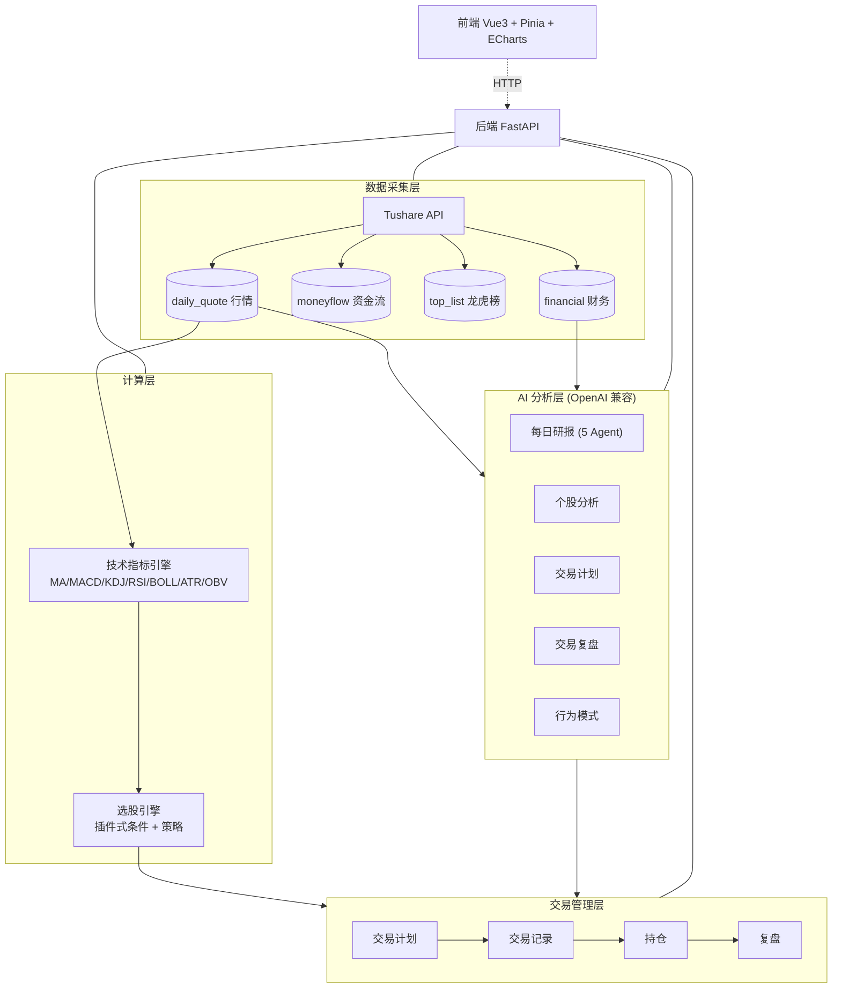

<div align="center">

# TradeLoop · 知行盘

**一个跑在你自己电脑上的 A 股交易研究工作台 —— 从看盘、选股、AI 分析，到记账、持仓、AI 复盘的完整闭环。**

[](https://github.com/<your-username>/tradeloop/actions/workflows/ci.yml)


[English](./README.en.md) · [风险免责](./FINANCIAL_DISCLAIMER.md) · [数据说明](./DATA_LICENSE.md) · [隐私](./PRIVACY.md)

</div>

> ⚠️ **本项目仅供学习与研究，不构成任何投资建议**。数据可能有误且非实时，AI 不预测涨跌、不给出买卖建议。详见 [风险免责声明](./FINANCIAL_DISCLAIMER.md)。

---

## 这是什么

TradeLoop（知行盘）是一个**完全本地化**的个人 A 股交易研究系统：数据存在你自己的电脑里，AI 分析调用你自己配置的大模型。它把一次完整的交易过程串成闭环：

```
看大盘 → 选股 → AI 分析 → 做交易计划 → 记录买卖 → 追踪持仓 → AI 复盘 → 发现交易毛病
```

“知行合一”——**分析是知，交易是行，复盘验证知行**，这正是项目名的由来。

## 界面预览

> 以下截图基于内置的**合成演示数据**（`data/sample.db`，虚构、非真实行情）。

| 市场仪表盘 | 个股 K 线 + 持仓 |
|:---:|:---:|
|  |  |
| **策略筛选（插件式选股引擎）** | **市场情绪** |
|  |  |
| **AI 交易计划（激进/稳健/保守三套方案）** | **AI 交易复盘（8 维雷达评分）** |
|  |  |

## 核心功能

- **市场仪表盘**：涨跌家数、涨停跌停、行业热度、市场宽度趋势。
- **选股引擎**：8 个可插拔筛选条件 + 多套策略，自由组合（插件式架构，新增条件零侵入）。
- **自选股管理**：分组维护、实时报价。
- **AI 智能分析**：5 个 Agent 串联生成每日研报；个股技术面 + 基本面深度分析。
- **AI 交易计划**：生成激进/稳健/保守三套方案（入场/止损/分批止盈/仓位）。
- **交易记账 + 持仓**：自动计算佣金/印花税/过户费，持仓与盈亏自动重算。
- **AI 交易复盘**：对已清仓交易做 8 维度评分（雷达图），并在多笔后识别交易行为模式。
- **22 项技术指标**：MA/MACD/KDJ/RSI/BOLL/ATR/OBV 等预计算。

## 架构



## 技术栈

- **后端**：Python 3.12、FastAPI、SQLAlchemy、SQLite、Alembic、Pandas、Tushare、OpenAI SDK、APScheduler；uv 管理，pytest 测试，ruff lint。
- **前端**：Vue 3、TypeScript、Pinia、Element Plus、ECharts、Vite；pnpm。

## 快速开始

### 方式一：Docker（一条命令，开箱演示）
```bash
docker compose up --build
```
- 前端：http://localhost:5173 ，后端 API 文档：http://localhost:8000/docs
- 自动使用内置合成数据 `data/sample.db`，无需 token。
- **国内网络**：默认走国际源（pypi.org / npmjs / ghcr 已不再依赖）。若构建慢/超时，用镜像源构建：
  ```bash
  PIP_INDEX_URL=https://pypi.tuna.tsinghua.edu.cn/simple \
  UV_INDEX_URL=https://pypi.tuna.tsinghua.edu.cn/simple \
  NPM_REGISTRY=https://registry.npmmirror.com \
  docker compose build && docker compose up
  ```
  Windows PowerShell 可在 `docker-compose.yml` 同级放 `.env` 写这三行后再 `docker compose up --build`。

### 方式二：本地手动
```bash
# 后端
cd backend
uv sync
cp ../config/local.toml.example ../config/local.toml   # 填 token/api_key（演示可留空）
cp ../data/sample.db ../data/stock.db                  # 用合成数据开箱演示
uv run uvicorn app.main:app --reload                   # http://localhost:8000/docs

# 前端（另开一个终端）
cd frontend
pnpm install
pnpm dev                                               # http://localhost:5173
```
> 中国大陆网络若 `pnpm install` 缓慢，可加镜像：`pnpm install --registry https://registry.npmmirror.com`。

## 数据准备

7.8GB 的真实数据库不随仓库分发。三种获取数据的方式：

1. **合成演示库（最快）**：仓库自带 `data/sample.db`（虚构数据），`cp data/sample.db data/stock.db` 即可开箱看效果。
2. **小样本真实数据**：配好自己的 Tushare token，运行
   ```bash
   uv run python scripts/seed_demo.py --stocks 600519.SH,000001.SZ --start 20250101 --end 20251231
   ```
3. **完整历史**：配 token 后触发完整回填（约 5000 只 × 多年，耗时较长，需相应 Tushare 积分）。

> 真实行情数据来自 [Tushare](https://tushare.pro)，仅供个人本地使用，详见 [数据说明](./DATA_LICENSE.md)。

## 配置

- 公开默认配置：`config/default.toml`（进 Git）。
- 私密配置：`config/local.toml`（**不进 Git**），从 `config/local.toml.example` 复制后填写：
  - `[tushare] token`：你的 Tushare token。
  - `[llm] api_key`：OpenAI 兼容服务的 key。

## AI / 大模型

默认 DeepSeek（`deepseek-chat`），任何 **OpenAI 兼容**接口都可用：把 `[llm].base_url` 指向 DeepSeek / Kimi / Ollama / LM Studio 即可。用本地模型（如 Ollama）可让数据完全不出本机。AI 功能发送哪些数据见 [隐私说明](./PRIVACY.md)。

## 项目结构
```
tradeloop/
├── backend/          # FastAPI 后端（api / services / models）
├── frontend/         # Vue3 前端（views / stores / components）
├── config/           # default.toml（公开）/ local.toml（私密，不入库）
├── data/             # sample.db（合成演示库）；真实库不入库
├── scripts/          # generate_sample_db.py / seed_demo.py
└── docs/             # 文档与截图
```

## 测试
```bash
cd backend && uv run python -m pytest tests/ -q      # 后端单测/契约
cd backend && uv run ruff check .
cd frontend && pnpm type-check && pnpm build
cd frontend && pnpm test                             # vitest 前端单测
cd frontend && pnpm test:e2e                          # Playwright 烟测（首次需 playwright install chromium）
```

## 一键演示
```powershell
pwsh scripts/demo_walkthrough.ps1   # 灌合成样例库 → 起后端 → 起前端 → 开浏览器
```

## 文档
- **Domain 设计文档（图文讲金融逻辑）**：[交易闭环·费用与持仓规则](./docs/domain/trade-loop.md) · [选股引擎](./docs/domain/screening-engine.md) · [全部 ▸](./docs/domain/README.md)
- [更新日志 CHANGELOG](./CHANGELOG.md) · [贡献指南](./CONTRIBUTING.md)
- [风险免责](./FINANCIAL_DISCLAIMER.md) · [数据说明](./DATA_LICENSE.md) · [隐私](./PRIVACY.md)

## 许可

代码以 [MIT](./LICENSE) 开源；数据不在 MIT 覆盖范围（见 [数据说明](./DATA_LICENSE.md)）。

**免责**：本项目仅供学习研究，不构成投资建议，使用风险自负。
