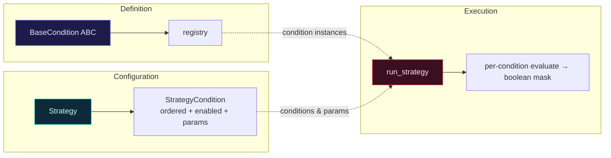

# Screening Engine · Pluggable Condition Filtering

> [中文（primary）](./screening-engine.md) · English · [Back to domain index](./README.md)

This note explains TradeLoop's screening engine: how "one giant SQL" was refactored into a **pluggable, configurable, decoupled** condition system, and the full data flow of one screening run from strategy to candidates.

---

## 1. Why not one giant SQL

Early screening was a few-hundred-line SQL: tuning a parameter meant editing code, adding a condition meant rewriting the SQL, every change risked a bug, and conditions were tightly coupled.

The engine splits it into three layers:



- **Definition** — each condition is a class extending `BaseCondition`, declaring `code / name / category / param_defs` and the core method `evaluate(df, db, params)`, registered into a global `registry` (`app/services/conditions/base.py`).
- **Configuration** — a **strategy = an ordered set of conditions**, each with its own params, enabled flag, and sort order (`StrategyCondition`). Change a strategy without touching code.
- **Execution** — `run_strategy` reads the strategy → pulls condition instances from the registry → feeds full-market quotes → produces a boolean mask → intersects them (`app/services/screening.py:49`).

Adding a condition never touches old code; old conditions retune freely — **fully decoupled**.

---

## 2. Data flow of one run

```mermaid
flowchart TD
    A[pick trade_date<br/>default: latest trading day] --> B[get_market_df<br/>full-market quotes DataFrame]
    B --> C{each enabled condition}
    C --> D["condition.evaluate(df, db, params)<br/>→ True/False per stock"]
    D --> E["mask = mask AND condition_mask<br/>(AND semantics)"]
    E --> C
    C -->|all conditions done| F[df[mask] → candidates]
    F --> G[save StrategyRun<br/>+ ScreeningResult snapshots]
    G --> H[return candidates + duration + hit count]
```

Corresponding code (`app/services/screening.py`):

```python
# pull full market, build a boolean mask per condition, intersect (AND)
mask = pd.Series([True] * len(df), index=df.index)
for sc in sc_list:                       # enabled conditions, by sort_order
    condition = registry.get(sc.condition_code)
    condition_mask = condition.evaluate(df, db, sc.get_params())
    mask = mask & condition_mask.reindex(df.index, fill_value=False)
result_df = df[mask].copy()
```

Design notes:

- **AND semantics**: multiple conditions mean "all satisfied at once". The mask uses `reindex(..., fill_value=False)` to align indices — a stock not covered by a condition is treated as failing, avoiding false positives from index misalignment.
- **Traceable results**: every run persists a `StrategyRun` (name, date, hit count, duration) and per-stock `ScreeningResult` snapshots (close, amount in 亿, market cap in 亿, pct change, industry), so you can review and compare history — not just a bare list of codes.
- **Centralized unit conversion**: amount (千元→亿) and market cap (万元→亿) go through constants `AMOUNT_UNIT_TO_YI / MV_UNIT_TO_YI`, preventing unit confusion (a real "amount unit miscalc" bug was fixed historically).

---

## 3. Condition errors: fail loud, never silently skip

If a condition throws during execution, the engine **returns an error immediately** naming the offending condition, rather than quietly skipping it — otherwise the user gets a "looks fine but silently dropped a condition" dangerous result:

```python
try:
    condition_mask = condition.evaluate(df, db, params)
except Exception as e:
    return build_error(f"condition '{sc.condition_code}' failed: {e}")
```

"Better an error than a silently wrong result" — a safety floor for a financial tool, locked by a dedicated red/green test (`test_condition_error_propagates`).

---

## 4. Built-in conditions

Conditions group by `category`, which the strategy editor uses to organize the UI:

| Category | code | Name | Intuition |
|---|---|---|---|
| Volume/Price | `amount_gt` | Amount above threshold | drop illiquid names |
| Ranking | `amount_rank` | Top-N by amount | only the day's most active |
| Market cap | `market_cap_gt` | Market cap above threshold | avoid micro-cap extremes |
| Technical | `ma_proximity` | Price above MA, limited deviation | trend on, not overheated |
| Technical | `ma_slope` | MA sloping up, gently | mild uptrend, reject spikes |
| Technical | `multi_ma_alignment` | Bullish MA alignment | short/mid/long MAs stacked up |
| Technical | `price_rise_range` | Had a big rise in window | names that already showed ignition |
| Fundamental | `profit_growth` | Rising non-recurring net profit | earnings-driven, filters pure themes |

Each condition declares `param_defs` (name, type, default, description), from which the frontend **auto-generates the parameter form** — adding a condition needs zero UI changes.

---

## 5. What a strategy looks like

> Example: "Main-board volume breakout" = the intersection of three conditions
>
> 1. `amount_gt`: amount ≥ 200M (liquidity)
> 2. `market_cap_gt`: market cap ≥ 5B (exclude micro-caps)
> 3. `multi_ma_alignment`: MA5 > MA10 > MA20 (bullish alignment)
>
> The engine evaluates all three per stock across the market, intersects, and outputs the day's hit list with snapshots. Changing thresholds or conditions is just config — no code change.

---

## Related code

- Condition base & registry: `backend/app/services/conditions/base.py`
- Built-in conditions: `backend/app/services/conditions/*.py`
- Execution engine: `backend/app/services/screening.py` (`run_strategy`)
- Strategy & result models: `backend/app/models/strategy.py`

> Disclaimer: screening results are for research only, not investment advice. See [FINANCIAL_DISCLAIMER.md](../../FINANCIAL_DISCLAIMER.md).
