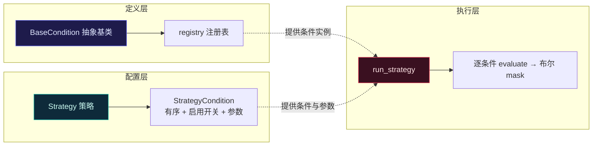
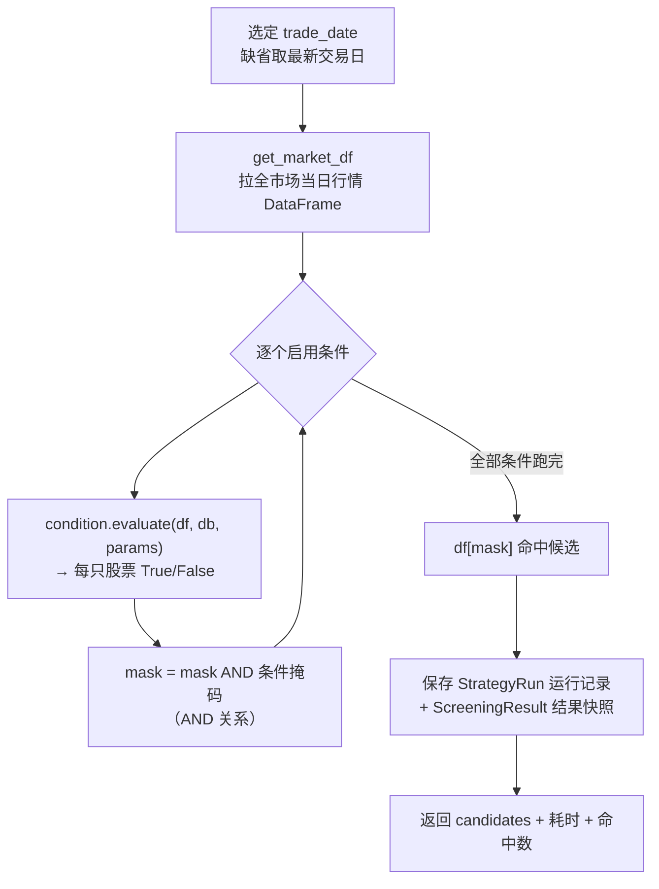

# 选股引擎 · 插件式条件筛选

> 中文（主） · [English](./screening-engine.en.md) · [返回 domain 索引](./README.md)

本文讲清 TradeLoop 的选股引擎：如何把"一条大 SQL"重构成**可插拔、可配置、可解耦**的条件系统，以及一次筛选从策略到候选股的完整数据流。

---

## 1. 为什么不是一条大 SQL

早期选股是一条几百行的 SQL：想调参数要改代码，想加条件要重写 SQL，每次改动都可能引入 bug，且条件之间高度耦合。

引擎把它拆成三层：



- **定义层**：每个条件是一个继承 `BaseCondition` 的类，声明 `code / name / category / param_defs` 与核心方法 `evaluate(df, db, params)`，并注册到全局 `registry`（`app/services/conditions/base.py`）。
- **配置层**：一个**策略 = 一组有序的条件**，每个条件带自己的参数值、启用开关、排序（`StrategyCondition`）。改策略不改代码。
- **执行层**：`run_strategy` 读取策略 → 从注册表取条件实例 → 喂全市场行情 → 得到布尔掩码 → 取交集（`app/services/screening.py:49`）。

新增条件不影响旧代码，旧条件随时改参数——**完全解耦**。

---

## 2. 一次筛选的数据流



对应代码（`app/services/screening.py`）：

```python
# 拉全市场行情，逐条件做布尔掩码并取交集（AND）
mask = pd.Series([True] * len(df), index=df.index)
for sc in sc_list:                       # 仅启用的条件，按 sort_order
    condition = registry.get(sc.condition_code)
    condition_mask = condition.evaluate(df, db, sc.get_params())
    mask = mask & condition_mask.reindex(df.index, fill_value=False)
result_df = df[mask].copy()
```

设计要点：

- **AND 语义**：多个条件是"同时满足"。掩码用 `reindex(..., fill_value=False)` 对齐索引——某条件没覆盖到的股票视为不通过，避免索引错位带来的假阳性。
- **结果可追溯**：每次运行存 `StrategyRun`（策略名、日期、命中数、耗时）与逐只 `ScreeningResult` 快照（收盘价、成交额亿、市值亿、涨跌幅、行业），便于历史回看与对比，而不是只给一串代码。
- **单位换算集中**：成交额(千元→亿)、市值(万元→亿)用常量 `AMOUNT_UNIT_TO_YI / MV_UNIT_TO_YI` 统一换算，杜绝口径混乱（历史上修过一个"成交额单位换错"的真实 bug）。

---

## 3. 条件报错：显式失败，绝不静默跳过

如果某个条件执行时抛异常，引擎**立即返回错误**并指明是哪个条件，而不是悄悄跳过它继续跑——否则用户会拿到"看似正常、实则少算了一个条件"的危险结果：

```python
try:
    condition_mask = condition.evaluate(df, db, params)
except Exception as e:
    return build_error(f"条件「{sc.condition_code}」执行出错：{e}")
```

"宁可报错，不可静默给错结果"——这是金融工具的安全底线，也有专门的红绿测试锁定该行为（`test_condition_error_propagates`）。

---

## 4. 内置条件清单

条件按 `category` 分组，前端策略编辑器据此分类展示：

| 分类 | code | 名称 | 直觉 |
|---|---|---|---|
| 量价 | `amount_gt` | 成交额大于阈值 | 过滤掉没人交易的票，保证流动性 |
| 排名 | `amount_rank` | 成交额排名前 N | 只看当日最活跃的一批 |
| 市值 | `market_cap_gt` | 总市值大于阈值 | 规避超小盘的极端波动 |
| 技术 | `ma_proximity` | 价格在均线上方且偏离有限 | 趋势在但不过热，回踩可接 |
| 技术 | `ma_slope` | 均线斜率向上且平缓 | 温和上行，拒绝陡峭拉升 |
| 技术 | `multi_ma_alignment` | 均线多头排列 | 短中长均线依次向上 |
| 技术 | `price_rise_range` | 区间内曾大涨 | 找有过启动迹象的标的 |
| 基本面 | `profit_growth` | 扣非净利润连续增长 | 业绩驱动，过滤纯题材 |

每个条件都声明了 `param_defs`（参数名、类型、默认值、说明），前端据此**自动生成参数表单**——加一个条件，UI 无需改一行。

---

## 5. 一个策略长什么样

> 例：「主板放量上行」= 三个条件的交集
>
> 1. `amount_gt`：成交额 ≥ 2 亿（流动性）
> 2. `market_cap_gt`：总市值 ≥ 50 亿（剔除超小盘）
> 3. `multi_ma_alignment`：MA5 > MA10 > MA20（多头排列）
>
> 引擎对全市场逐只判断三个条件、取交集，输出当日命中清单并存快照。改阈值、加减条件，都只是改策略配置，不动代码。

---

## 相关代码

- 条件基类与注册表：`backend/app/services/conditions/base.py`
- 各内置条件：`backend/app/services/conditions/*.py`
- 执行引擎：`backend/app/services/screening.py`（`run_strategy`）
- 策略与结果模型：`backend/app/models/strategy.py`

> 免责声明：筛选结果仅供研究参考，不构成投资建议。详见仓库根 [FINANCIAL_DISCLAIMER.md](../../FINANCIAL_DISCLAIMER.md)。
