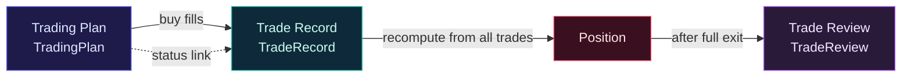
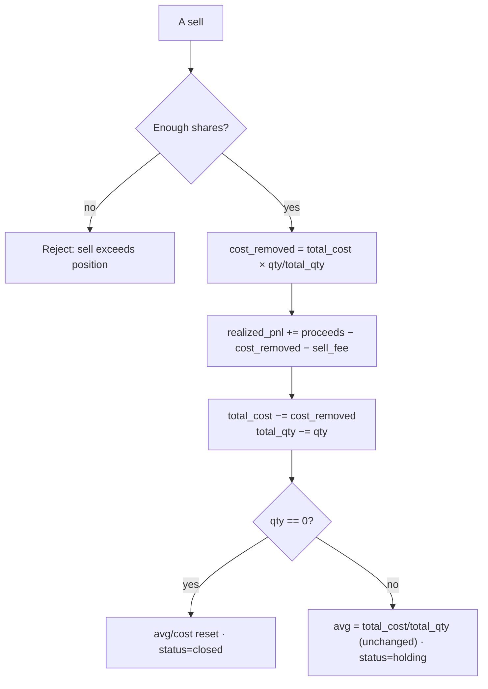

# Trade Loop · Fees & Position Rules

> [中文（primary）](./trade-loop.md) · English · [Back to domain index](./README.md)

This note explains TradeLoop's core financial logic: the full loop from **plan** → **trade** → **position cost & PnL** → **review**, and the A-share trading rules behind each step. Every rule maps to real code; a hand-checkable worked example is at the end.

---

## 1. The loop at a glance



- **Plan** — AI or manual target/stop/take-profit/position-size; status `pending`.
- **Trade** — each buy/sell fill (price, qty, fee, time). A buy linked to a `pending` plan flips it to `executed` (`app/services/trade.py:89`). A sell is rejected if it exceeds the current position (`app/services/trade.py:68`).
- **Position** — never a mutable running state; instead **recomputed from all of that stock's trades in time order** (event-sourcing style), so it stays consistent after any back-fill or edit (`app/services/position.py:94`).
- **Review** — after a full exit, the whole episode is scored across 8 dimensions (section 5).

---

## 2. A-share fee rules

Fees live in one pure function `calculate_trade_fee` (`app/services/trade_contract.py:22`); each of the three has its own scope:

| Fee | Formula | Side | Market |
|---|---|---|---|
| Commission | `amount × commission_rate` | buy + sell | all |
| Stamp tax | `amount × stamp_tax_rate` | **sell only** | all |
| Transfer fee | `amount × transfer_fee_rate` | buy + sell | **Shanghai only** (`.SH` suffix) |

```python
commission   = amount * commission_rate
stamp_tax    = amount * stamp_tax_rate   if direction == "sell" else 0.0
transfer_fee = amount * transfer_fee_rate if is_sh_stock(ts_code) else 0.0
fee = round_money(commission + stamp_tax + transfer_fee)
```

Design notes:

- **Rates are configurable** in `user_config` (UI: Settings → trading fees; demo defaults: commission 0.025%, stamp tax 0.1%, transfer fee 0.002%). If a trade is entered without an explicit fee, it is auto-computed; manual override is allowed (`app/services/trade.py:30`).
- **Stamp tax is one-sided**: since 2008 A-share stamp tax is levied on the sell side only — that is why `if direction == "sell"` is in the formula, not a typo.
- **Transfer fee is market-specific**: Shanghai charges it on amount, Shenzhen does not, hence `is_sh_stock` (`.SH` suffix).
- **All money is rounded to 6 dp** via `round_money`, keeping float drift out of cost and PnL.

---

## 3. Position cost: moving weighted average, buy fee folded into cost

On each **buy**, "amount + buy fee" is added to total cost, then divided by total shares for the moving weighted-average cost (`app/services/position.py:60`):

```python
state["total_cost"]     += trade.amount + trade.fee   # buy fee folded into cost
state["total_quantity"] += trade.quantity
state["avg_cost"]        = round_money(state["total_cost"] / state["total_quantity"])
```

Folding the buy fee into cost makes the average price reflect the true entry cost — you only really profit once price clears this fee-inclusive average.

---

## 4. Sell: proportional cost amortization, no average drift (the core)

A sell must **not** subtract cost using "rounded average × shares sold" — after repeated trades the discarded rounding residue accumulates and the remaining cost/average drift systematically. The correct approach **amortizes the original total cost by the sold fraction** (`app/services/position.py:72`):

```python
# exact proportional amortization: sell X% of shares -> remove X% of total cost
cost_removed = state["total_cost"] * trade.quantity / state["total_quantity"]
state["realized_pnl"] += trade.price * trade.quantity - cost_removed - trade.fee
state["total_cost"]   -= cost_removed
state["total_quantity"] -= trade.quantity
```

- **Realized PnL** = proceeds − amortized cost − sell fee. The sell fee is taken out of the gain, matching the intuition that locking in profit means paying fees/tax first.
- **Average is unchanged after a partial sell**: cost and shares shrink by the same fraction, so `total_cost / total_quantity` is invariant — the financial-correctness payoff of proportional amortization (see the example).
- **Full exit** (shares → 0): total cost and average reset to 0, status `closed`, ready for review.



---

## 5. Worked example: two buys + a partial sell (Shanghai 600000.SH)

Rates: commission 0.00025, stamp tax 0.001, transfer fee 0.00002.

**① Buy 1000 @ ¥10.00**

| Item | Calc | Value |
|---|---|---|
| Amount | 10.00 × 1000 | 10000.00 |
| Commission | 10000 × 0.00025 | 2.50 |
| Transfer (SH) | 10000 × 0.00002 | 0.20 |
| Stamp (buy: none) | — | 0.00 |
| **Total fee** | | **2.70** |
| Total cost | 10000 + 2.70 | 10002.70 |
| Avg cost | 10002.70 / 1000 | **10.0027** |

**② Buy 500 @ ¥12.00**

| Item | Calc | Value |
|---|---|---|
| Amount / fee | 6000 × (0.00025+0.00002) | 6000.00 / 1.62 |
| Total cost | 10002.70 + 6001.62 | 16004.32 |
| Total shares | 1000 + 500 | 1500 |
| Avg cost | 16004.32 / 1500 | **10.6695** |

**③ Sell 600 @ ¥15.00**

| Item | Calc | Value |
|---|---|---|
| Amount | 15.00 × 600 | 9000.00 |
| Commission / stamp / transfer | 2.25 / 9.00 / 0.18 | |
| **Sell fee** | | **11.43** |
| cost_removed | 16004.32 × 600/1500 | 6401.728 |
| **Realized PnL** | 9000 − 6401.728 − 11.43 | **≈ 2586.84** |
| Remaining cost | 16004.32 − 6401.728 | 9602.592 |
| Remaining shares | 1500 − 600 | 900 |
| Avg cost | 9602.592 / 900 | **10.6695 (unchanged)** |

> Key observation: after the partial sell the average is still **10.6695**, identical to before. Subtracting "rounded average × shares" would bias the remaining cost, and the error compounds over many trades — exactly why proportional amortization is used.

---

## 6. Review dimensions after a full exit

A closed episode yields a `TradeReview`, scored 1–10 by AI across 8 dimensions, overall = the mean (`app/services/review_contract.py`):

| Dimension | Meaning | Dimension | Meaning |
|---|---|---|---|
| entry_timing | quality of the entry | holding_period | appropriateness of holding time |
| exit_timing | quality of the exit | discipline | adherence to the plan |
| stop_loss | stop placement/execution | risk_reward | risk/reward match |
| take_profit | target placement/execution | position_sizing | sizing prudence |

Decomposing "did I make money" into reviewable behavioral dimensions is the system's core belief: **outcomes carry luck; only the process is sustainably improvable.**

---

## Related code

- Fees: `backend/app/services/trade_contract.py` (`calculate_trade_fee` / `is_sh_stock` / `round_money`)
- Trades & status link: `backend/app/services/trade.py`
- Position recompute (cost amortization / realized PnL): `backend/app/services/position.py` (`_rebuild_position_state`)
- Review dimensions: `backend/app/services/review_contract.py`

> Disclaimer: this is a personal trading-assistant and learning tool, not investment advice. See [FINANCIAL_DISCLAIMER.md](../../FINANCIAL_DISCLAIMER.md).
