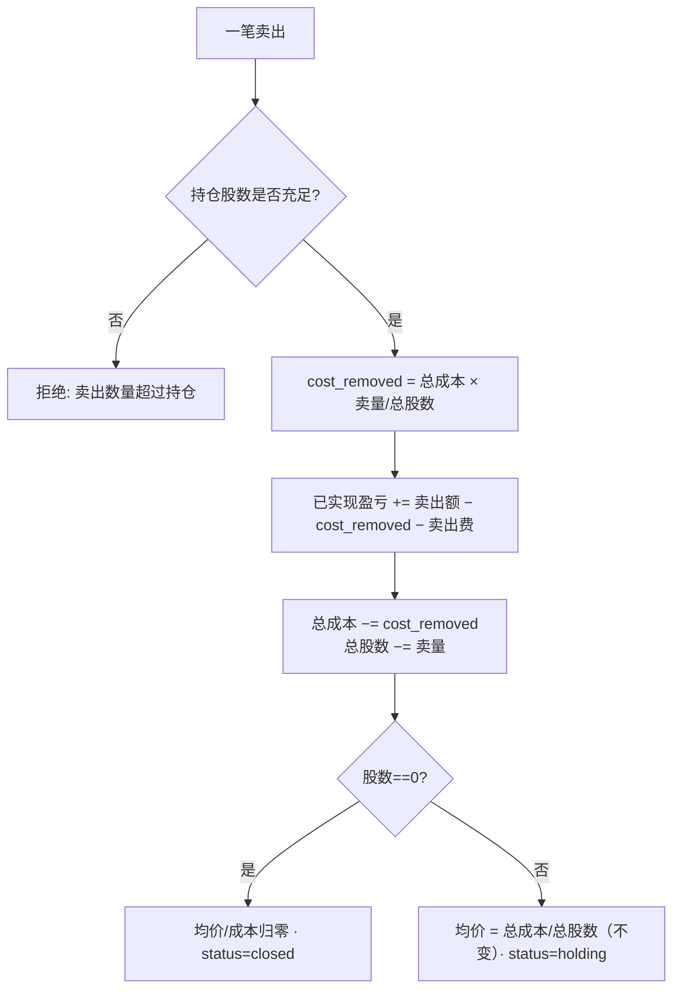

# 交易闭环 · 费用与持仓规则

> 中文（主） · [English](./trade-loop.en.md) · [返回 domain 索引](./README.md)

本文讲清 TradeLoop 的核心金融逻辑：一笔交易从**计划**到**成交**、到**持仓成本与盈亏**、再到**复盘**的完整闭环，以及其中每一步背后的 A 股交易规则。所有规则都对应真实代码，文末给出可手算复核的数字算例。

---

## 1. 闭环全景


- **计划（Plan）**：AI 或人工给出目标价、止损价、止盈、仓位比例；状态 `pending`。
- **成交（Trade）**：记录每一笔买/卖（价、量、费用、时间）。买入成交若关联了 `pending` 计划，会把计划自动置为 `executed`（`app/services/trade.py:89`）。卖出前校验持仓充足，杜绝"卖飞"（`app/services/trade.py:68`）。
- **持仓（Position）**：不维护可变的运行态，而是**从该股票全部成交按时间重算**（event sourcing 思路），保证任何补录/修改后状态都自洽（`app/services/position.py:94`）。
- **复盘（Review）**：清仓后对整段交易按 8 个维度打分（见第 5 节）。

---

## 2. A 股交易费用规则

费用计算集中在一个纯函数 `calculate_trade_fee`（`app/services/trade_contract.py:22`），三项费用各有适用边界：

| 费用 | 公式 | 适用方向 | 适用市场 |
|---|---|---|---|
| 佣金 commission | `成交额 × 佣金费率` | 买 + 卖（双向） | 全部 |
| 印花税 stamp tax | `成交额 × 印花税率` | **仅卖出** | 全部 |
| 过户费 transfer fee | `成交额 × 过户费率` | 买 + 卖 | **仅沪市**（代码以 `.SH` 结尾） |

```python
commission   = amount * commission_rate
stamp_tax    = amount * stamp_tax_rate   if direction == "sell" else 0.0
transfer_fee = amount * transfer_fee_rate if is_sh_stock(ts_code) else 0.0
fee = round_money(commission + stamp_tax + transfer_fee)
```

设计要点：

- **费率可配置**，存在 `user_config`，前端"设置 → 交易费率"可改（演示默认：佣金万 2.5、印花税千 1、过户费万 0.2）。录入交易时若不手填费用，则按当前费率自动计算；也允许手动覆盖（`app/services/trade.py:30`）。
- **印花税单边**：2008 年起 A 股印花税仅在卖出环节单边征收——这是把 `if direction == "sell"` 写进公式的真实依据，而非笔误。
- **过户费分市场**：沪市按成交额计过户费，深市不另收，故用 `is_sh_stock`（`.SH` 后缀）区分。
- **金额统一 6 位四舍五入** `round_money`，避免浮点累积误差污染成本与盈亏。

---

## 3. 持仓成本：移动加权平均 + 买入费用入成本

每次**买入**，把"成交额 + 买入费用"一起计入总成本，再除以总股数得移动加权平均成本（`app/services/position.py:60`）：

```python
state["total_cost"]     += trade.amount + trade.fee   # 费用计入持仓成本
state["total_quantity"] += trade.quantity
state["avg_cost"]        = round_money(state["total_cost"] / state["total_quantity"])
```

把买入费用计入成本，是为了让"持仓均价"反映真实建仓代价——卖出时只有涨过这个含费均价才算真盈利。

---

## 4. 卖出：比例摊销成本，避免均价漂移（核心）

卖出时**不能**用"四舍五入后的均价 × 卖出股数"去回减总成本——反复买卖后，被舍入掉的尾差会累积，导致剩余成本与均价系统性漂移。正确做法是**按卖出比例摊销原始总成本**（`app/services/position.py:72`）：

```python
# 精确比例摊销：卖掉多少比例的股数，就摊掉多少比例的总成本
cost_removed = state["total_cost"] * trade.quantity / state["total_quantity"]
state["realized_pnl"] += trade.price * trade.quantity - cost_removed - trade.fee
state["total_cost"]   -= cost_removed
state["total_quantity"] -= trade.quantity
```

- **已实现盈亏** = 卖出额 − 摊出的成本 − 卖出费用。卖出费用从盈利里扣，符合"落袋为安要先交税费"的直觉。
- **部分卖出后均价不变**：因为成本与股数按同一比例减少，`total_cost / total_quantity` 保持不变——这正是比例摊销的金融正确性体现（见算例）。
- **清仓**（股数归零）：总成本、均价归零，状态置 `closed`，可进入复盘。



---

## 5. 算例：建仓两笔 + 部分卖出（沪市 600000.SH）

费率：佣金 0.00025、印花税 0.001、过户费 0.00002。

**① 买入 1000 股 @ ¥10.00**

| 项 | 计算 | 值 |
|---|---|---|
| 成交额 | 10.00 × 1000 | 10000.00 |
| 佣金 | 10000 × 0.00025 | 2.50 |
| 过户费（沪市） | 10000 × 0.00002 | 0.20 |
| 印花税（买入免） | — | 0.00 |
| **费用合计** | | **2.70** |
| 总成本 | 10000 + 2.70 | 10002.70 |
| 持仓均价 | 10002.70 / 1000 | **10.0027** |

**② 再买入 500 股 @ ¥12.00**

| 项 | 计算 | 值 |
|---|---|---|
| 成交额 / 费用 | 6000 × (0.00025+0.00002) | 6000.00 / 1.62 |
| 总成本 | 10002.70 + 6001.62 | 16004.32 |
| 总股数 | 1000 + 500 | 1500 |
| 持仓均价 | 16004.32 / 1500 | **10.6695** |

**③ 卖出 600 股 @ ¥15.00**

| 项 | 计算 | 值 |
|---|---|---|
| 成交额 | 15.00 × 600 | 9000.00 |
| 佣金 / 印花税 / 过户费 | 2.25 / 9.00 / 0.18 | |
| **卖出费用** | | **11.43** |
| 摊出成本 cost_removed | 16004.32 × 600/1500 | 6401.728 |
| **已实现盈亏** | 9000 − 6401.728 − 11.43 | **≈ 2586.84** |
| 剩余总成本 | 16004.32 − 6401.728 | 9602.592 |
| 剩余股数 | 1500 − 600 | 900 |
| 持仓均价 | 9602.592 / 900 | **10.6695（不变）** |

> 关键观察：部分卖出后均价仍是 **10.6695**，与卖出前完全一致。若改用"四舍五入均价 × 股数"回减，剩余成本会偏离真实值，长期反复交易后误差越滚越大——这正是采用比例摊销的原因。

---

## 6. 清仓后的复盘维度

清仓的交易段可生成 `TradeReview`，由 AI 按 8 个维度各打 1–10 分，总分取均值（`app/services/review_contract.py`）：

| 维度 | 含义 | 维度 | 含义 |
|---|---|---|---|
| entry_timing 入场时机 | 买点是否合理 | holding_period 持有周期 | 持有时长是否得当 |
| exit_timing 出场时机 | 卖点是否合理 | discipline 纪律 | 是否按计划执行 |
| stop_loss 止损 | 止损设置/执行 | risk_reward 盈亏比 | 风险收益是否匹配 |
| take_profit 止盈 | 止盈设置/执行 | position_sizing 仓位 | 仓位是否适度 |

把"赚没赚钱"拆成可复盘的行为维度，是这套系统想表达的核心理念：**结果有运气成分，过程才可持续改进**。

---

## 相关代码

- 费用：`backend/app/services/trade_contract.py`（`calculate_trade_fee` / `is_sh_stock` / `round_money`）
- 成交与状态联动：`backend/app/services/trade.py`
- 持仓重算（成本摊销 / 已实现盈亏）：`backend/app/services/position.py`（`_rebuild_position_state`）
- 复盘维度：`backend/app/services/review_contract.py`

> 免责声明：本系统仅为个人交易辅助与学习工具，不构成投资建议。详见仓库根 [FINANCIAL_DISCLAIMER.md](../../FINANCIAL_DISCLAIMER.md)。
